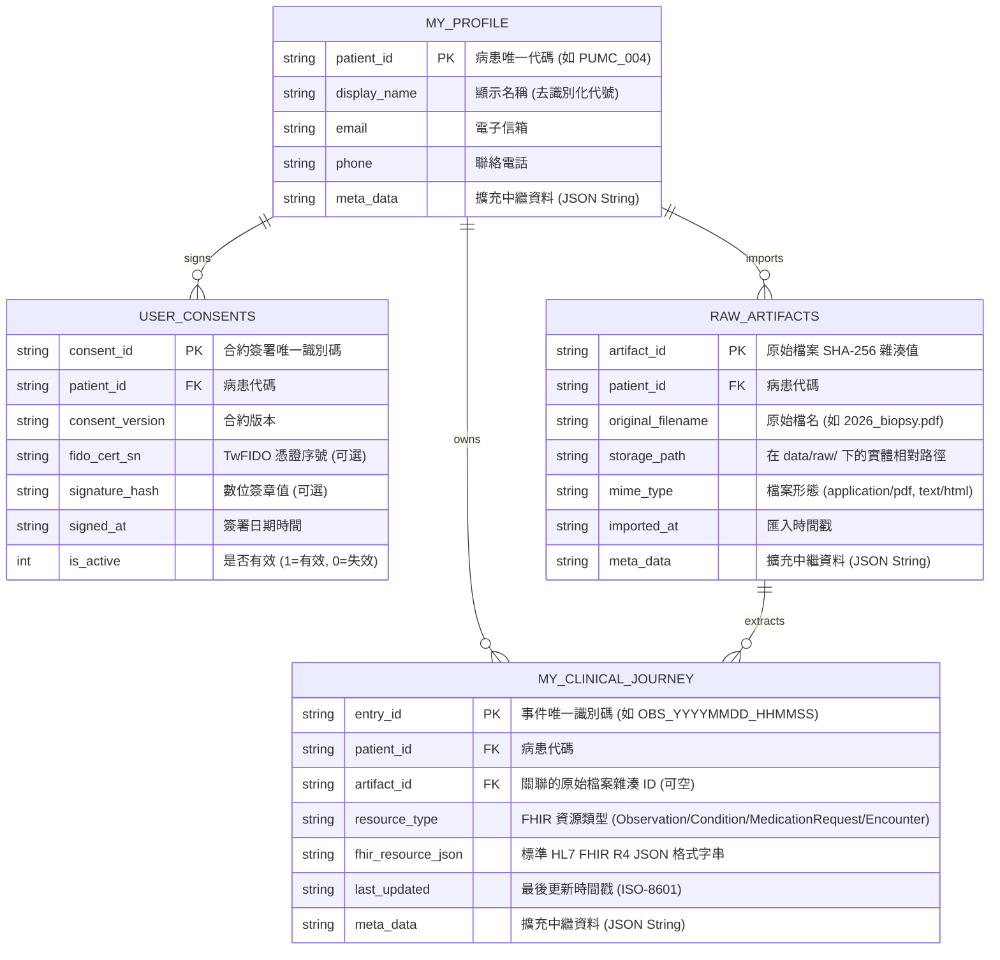

# sovereign-health-agent: 資料庫架構與跨庫查詢協同契約 Prompt

> **調用主體**：需理解或跨庫查詢個人自主 PHR 資料庫（`fv_patient_personal.db`）、範本庫（`template.db`）或外部醫療巨量資料庫（`med.db`）之外部 Agent 或後端服務。  
> **遵守規格**：DGS v2.0 (資料庫治理規範) & SQLite 物理隔離架構。

---

## 1. 實體資料庫位置與四階解析路徑 (Priority Chain)

### 1.1 個人自主 PHR 資料庫 (端側私有庫)
* **實體位置**：`db/instances/{profile}/fv_patient_personal.db`（預設 profile 為 `myself`，範例展示帳號為 `PUMC_004` / 阿喜伯）
* **範本位置**：`db/template.db`（冷啟動時自動複製至 instances 目錄）
* **物理隔離保證**：每一位病患擁有專屬資料庫檔案，禁止多病患混存。

### 1.2 外部醫療巨量資料庫 (`tw-med-db`) 四階解析順序
1. **顯式 CLI 參數**：`--db <path>`
2. **環境變數**：`TW_MED_DB_PATH`、`MED_DB_PATH`、`MOHW_DB_PATH`
3. **專案配置檔案**：`config.json` 中的 `tw_med_db_path`
4. **預設候選路徑**：
   - 外接擴充儲存（標準位址）：`/Volumes/D2024/data/med-db-in/db/med.db`
   - 本地候選位址：`../../private_data/med-db-in/db/med.db` 或專案相對路徑

---

## 2. 個人 PHR 核心資料表 (Core Tables) 結構

本專案個人資料庫採用去識別化標準三表結構，以 `patient_id` 為主體錨點：



---

## 3. 唯讀跨庫掛載語法 (In-Process ATTACH)

外部 Agent 若需同時關聯個人歷程與公共藥證庫，統一使用 **唯讀模式 (mode=ro)** 掛載，杜絕誤寫入：

```sql
-- 掛載個人自主歷程庫 (唯讀)
ATTACH DATABASE 'file:db/instances/myself/fv_patient_personal.db?mode=ro' AS phr;

-- 掛載外部台灣醫療大數據庫 (唯讀)
ATTACH DATABASE 'file:/Volumes/D2024/data/med-db-in/db/med.db?mode=ro' AS med_db;

-- 跨庫碰撞查詢：比對個人用藥歷程與官方藥品許可證最新健保價格
SELECT 
    json_extract(j.fhir_resource_json, '$.medicationCodeableConcept.text') AS my_drug,
    j.last_updated,
    m.drug_name,
    m.nhi_code,
    m.nhi_price,
    m.indications
FROM phr.MY_CLINICAL_JOURNEY j
LEFT JOIN med_db.m01_tw_drug_db m 
    ON m.drug_name LIKE '%' || json_extract(j.fhir_resource_json, '$.medicationCodeableConcept.text') || '%'
WHERE j.resource_type = 'MedicationRequest'
ORDER BY j.last_updated DESC;
```

---

## 4. 跨專案資料主權與唯讀宣告

1. **嚴禁外部寫入個人健康庫**：`fv_patient_personal.db` 為病患本地主權資產，所有寫入行為必須經過本地 `patient_agent.py` 或由病患主動執行的 `nhia_html_parser.py` 等專屬 Tool，外部 Agent 不得直接執行未授權之 `INSERT/UPDATE/DELETE`。
2. **端側離線保證**：本資料庫結構完全依賴標準 SQLite，零雲端相依性。即使處於無網環境，所有查詢與結構化 JSON 解析皆能於 2ms 內完成。
