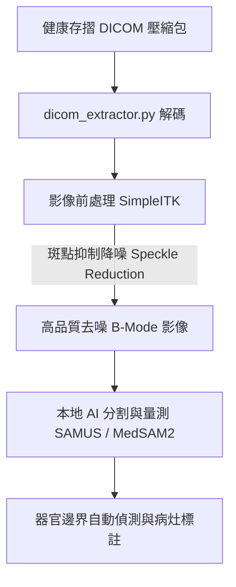

# 超音波影像解析開源工具研究報告

本文件整理了目前醫療影像界與學術界中，針對超音波影像（Ultrasound Imaging）解析、處理及 AI 分析的主要開源工具（Open-Source Tools）、函式庫（Libraries）與基底大模型（Foundation Models），並評估其整合至主權健康代理人（Sovereign Health Agent）專案的可行性。

---

## 一、 AI 與醫學影像分割大模型 (AI & Foundation Models)

近年來，隨著 Segment Anything Model (SAM) 的推廣，醫療超音波影像的 AI 自動分割與病灶辨識有了突破性的進展。

### 1. SAMUS (超音波專用 SAM 改造版)
*   **GitHub**: [romandong/SAMUS](https://github.com/romandong/SAMUS)
*   **定位**: 專門針對超音波影像特點進行微調（Fine-tune）的開源通用分割模型。
*   **特色**: 為了解決原始 SAM 在醫學超音波影像（對比度低、邊界模糊、雜訊多）表現不佳的問題而開發。在公開的超音波資料集上進行了大量的適配訓練，非常適合做為本地端超音波影像的自動分割基座。

### 2. MedSAM / MedSAM2 (通用醫學影像分割模型)
*   **GitHub**: [bowang-lab/MedSAM](https://github.com/bowang-lab/MedSAM)
*   **定位**: 目前醫學影像界最著名的開源大模型之一。
*   **特色**: MedSAM 支援多種醫療影像模態（CT、MRI、超音波等）。最新的 **MedSAM 2** 進一步將分割能力擴展到 3D 影像與超音波影片，且程式碼、模型權重及資料集皆完全開源，是當前實作本地端醫學影像分割的最佳選擇。

### 3. OpenUS (微軟超音波基底模型)
*   **GitHub**: [microsoft/OpenUS](https://github.com/microsoft/OpenUS)
*   **定位**: 基於最新 Vision Mamba (Vim) 架構的超音波影像分析開源基底大模型。
*   **特色**: 由微軟開源，使用大規模的多源超音波數據集進行預訓練。其架構相較於傳統 Transformer 能在更低的運算資源下處理高解析度影像，適用於超音波影像的分類、分割等下游任務。

### 4. BUSClean (乳房超音波資料清洗工具)
*   **GitHub**: [hawaii-ai/bus-cleaning](https://github.com/hawaii-ai/bus-cleaning)
*   **定位**: 專門針對乳房超音波（Speckle Noise 嚴重、標註雜亂）設計的資料清洗與前處理工具。
*   **特色**: 自動過濾無效掃描、裁切影像邊緣，並能將超音波檢查報告（如 BI-RADS 分級）進行結構化提取。

> [!IMPORTANT]
> **關於 SonoSAM 的閉源事實澄清**
> 在文獻中常被提及的 **SonoSAM**（專門用於超音波的 SAM 模型），目前**並未開源**。它主要是由奇異醫療（GE HealthCare）等機構開發的閉源研究專案。因此若要在本機部署，應優先選擇 **SAMUS** 或 **MedSAM2**。

---

## 二、 訊號處理與波束形成重建 (Signal Processing & Beamforming)

用於處理原始射頻訊號（RF Signal）並進行波束形成（Beamforming）與影像重建的底層研究工具：

### 1. USTB (UltraSound ToolBox)
*   **官網**: [ustb.no](https://www.ustb.no/)
*   **定位**: 基於 MATLAB / Python 的開源超音波訊號處理工具箱。
*   **特色**: 主要用於研究超音波波束形成演算法、剪切波彈性成像（Elastography）及都卜勒影像（Doppler Imaging）處理。

### 2. PyMUST
*   **GitHub**: [must-toolbox/PyMUST](https://github.com/must-toolbox/PyMUST)
*   **定位**: 適用於超音波物理模擬與訊號重建的 Python 函式庫。
*   **特色**: 能模擬聲波傳播，並協助研究人員處理射頻資料以合成 B-Mode 影像。

---

## 三、 即時視覺化與處理框架 (Real-time Processing & Visualization)

針對需要即時影像串流、機器人手持超音波、或臨床現場即時分析（POCUS）的應用：

### 1. PRETUS (即時超音波串流分析平台)
*   **GitHub**: [u-lab/pretus](https://github.com/u-lab/pretus)
*   **定位**: 硬體無涉（Manufacturer-agnostic）的即時超音波影像分析軟體平台。
*   **特色**: 採用插件式（Plug-in）架構，允許開發者將自訂的 AI 演算法（例如即時器官分割、導管追蹤）快速整合至即時超音波串流中。

### 2. UsTK (Ultrasound ToolKit)
*   **GitHub**: [lagadic/ustk](https://github.com/lagadic/ustk)
*   **定位**: 基於 C++ 的 2D/3D 超音波影像處理與視覺伺服（Visual Servoing）開發套件。
*   **特色**: 廣泛應用於醫療機器人控制超音波探頭的追蹤與定位。

---

## 四、 通用醫學影像處理庫 (降噪與配準)

提供了處理 DICOM 超音波影像最核心的演算法，與超音波流程高度相容：

### 1. SimpleITK / ITK
*   **官網**: [itk.org](https://itk.org/)
*   **特色**: 醫學影像處理的黃金標準庫。針對超音波影像特有的**斑點雜訊（Speckle Noise）**，SimpleITK 提供了強大的**斑點抑制降噪濾波器**（例如 Curvature Flow 或 Anisotropic Diffusion 濾波器），是影像分割前的必備預處理步驟。

### 2. 3D Slicer
*   **官網**: [slicer.org](https://www.slicer.org/)
*   **特色**: 極為強大的開源醫學影像視覺化與分析平台。結合其 **Plus Toolkit** 模組，可實現超音波影像的即時擷取、3D 空間追蹤校準與 3D 超音波重建。

---

## 五、 主權健康代理人 (Sovereign Health Agent) 整合建議

由於本專案主要使用 Python 作為開發語言，且已實作了基礎的 DICOM 資訊萃取模組（`dicom_extractor.py`），未來可以分階段引進以下開源工具：

1.  **影像預處理（降噪與品質提升）**：
    *   **整合工具**: **SimpleITK**
    *   **做法**: 引入 Python 版本的 SimpleITK，利用其 Anisotropic Diffusion 等濾波器來抑制超音波特有的斑點雜訊，使結構邊緣更清晰，提升後續 AI 辨識的精準度。
2.  **臨床 AI 自動分割與量測**：
    *   **整合工具**: **SAMUS** 或 **MedSAM2**
    *   **做法**: 當使用者匯入健康存摺超音波 DICOM 檔案後，透過預訓練的 SAMUS 模型進行推論（Inference），自動在無損 PNG 上標註出肝臟、膽囊或疑似病灶的邊界，提供給使用者作為基礎評估。

---

## 六、 針對病患端 (Patient-Facing) 的超音波影像與影片內容轉譯機制

對一般病患而言，直接觀看黑白的超音波影像或影片通常是「見樹不見林」，無法理解其中的臨床意義。因此，主權健康代理人可以開發一套**病患友善的超音波內容轉譯管線**，利用以下開源技術將影像轉換成易讀的白話資訊：

### 1. 畫面燒錄數值與標籤之 OCR 提取 (Burned-in Caliper & Text OCR)
*   **病患痛點**: 檢查人員常會將測量值（如 `1.5 cm`）與掃描部位簡寫（如 `GB` 代表膽囊、`LIV` 代表肝臟）直接「燒錄」在影像畫面的角落。病患無法自行解讀。
*   **開源工具**: **EasyOCR** (基於 PyTorch，適用於複雜佈局) 或 **Tesseract OCR** (設定數字白名單)。
*   **做法**: 
    1. 使用 OpenCV 定位超音波影像四周常見的資訊欄區域（Region of Interest, ROI）。
    2. 利用 EasyOCR 提取出所有文字與測量值（如 `GB Wall: 0.38cm`）。
    3. 翻譯並解釋給病患：「*在影像右上角偵測到膽囊壁測量值為 0.38 公分，對照標準值大於 0.3 公分可能代表有增厚現象，請確認您的書面報告是否有提及膽囊炎。*」

### 2. 測量游標 (Caliper) 的自動檢測與定位標示
*   **病患痛點**: 畫面中常出現黃色或白色的 `+` 或 `x` 量測游標，病患不知道醫生究竟在量哪裡。
*   **開源工具**: **OpenCV** (傳統電腦視覺特徵比對) 或 **YOLOv8** (輕量化目標檢測)。
*   **做法**:
    1. 使用 OpenCV 的模板匹配（Template Matching）或霍夫變換（Hough Transform），在影像中識別出 `+` 或 `x` 符號成對出現的位置。
    2. 在自動產出的病患報告中，將該量測區域以紅色高亮圈出，告訴病患：「*這個紅圈內是檢查人員在檢查過程中特別點出並測量大小的區域（通常是結節、息肉或器官邊界）。*」

### 3. 影片之器官定位導航 (Organ & Plane Auto-Navigation)
*   **病患痛點**: 下載的超音波影片（CINE loops）是一連串動態影格，病患不知道這幾秒鐘到底是在掃描哪一個器官。
*   **開源工具**: 基於 PyTorch 的輕量化分類模型（如微調過的 ResNet 或 MobileNet）。
*   **做法**:
    1. 對動態影片的各個影格進行即時分類，判定當前畫面屬於哪一個解剖學器官（如肝臟、膽囊、右腎、脾臟）。
    2. 提供「影片導航條」或白話時間軸，告訴病患：「*這段 10 秒的影片中，前 3 秒是在掃描您的肝臟，第 4 到 7 秒轉換為膽囊，最後 3 秒則掃描了您的右腎。*」

### 4. 影像與健康存摺書面報告的「雙軌交互驗證」(Report-to-Image Grounding)
*   **核心思維**: 將「影像中辨識到的資訊」與「健康存摺中的文字報告」進行對照。
*   **做法**:
    *   主權健康代理人同時讀取病患的超音波紙本 PDF 報告與解碼後的 DICOM 影像。
    *   比對兩者的數值（例如：報告文字寫有 `Gallstone 1.2 cm`，而影像 OCR 同時提取到 `1.2cm` 的量測值且影像分類為膽囊），此時代理人便能精準將該張圖片標記為：「*這張圖片即是您報告中所提到的『1.2 公分膽結石』的實際超音波照片。*」這能極大程度消除病患對黑白影像的困惑與焦慮。
